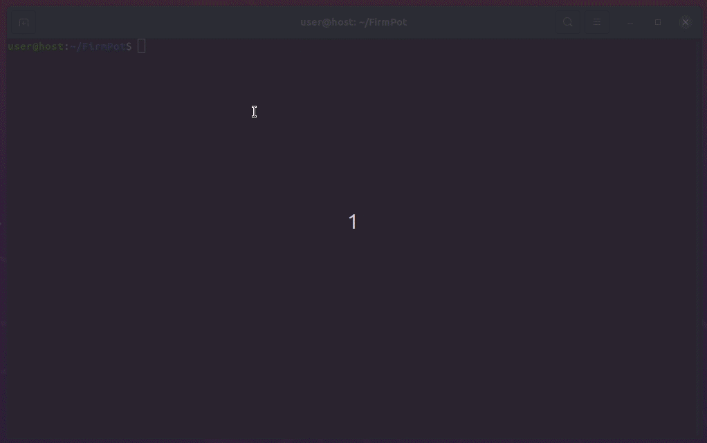
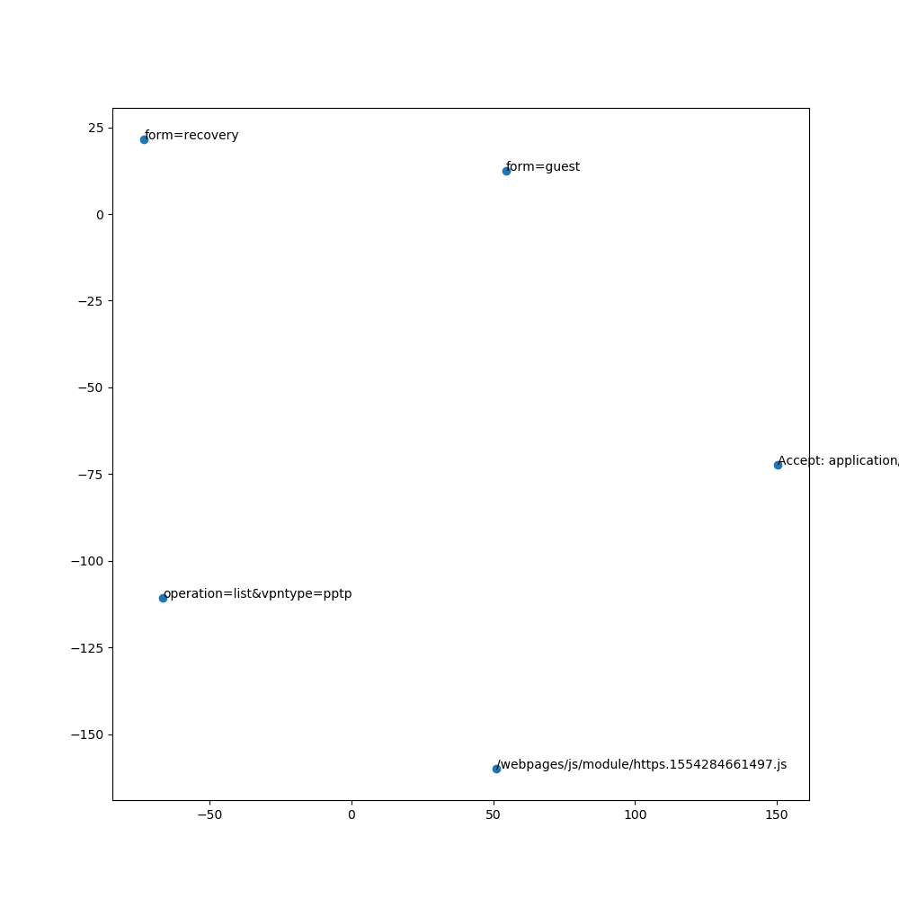
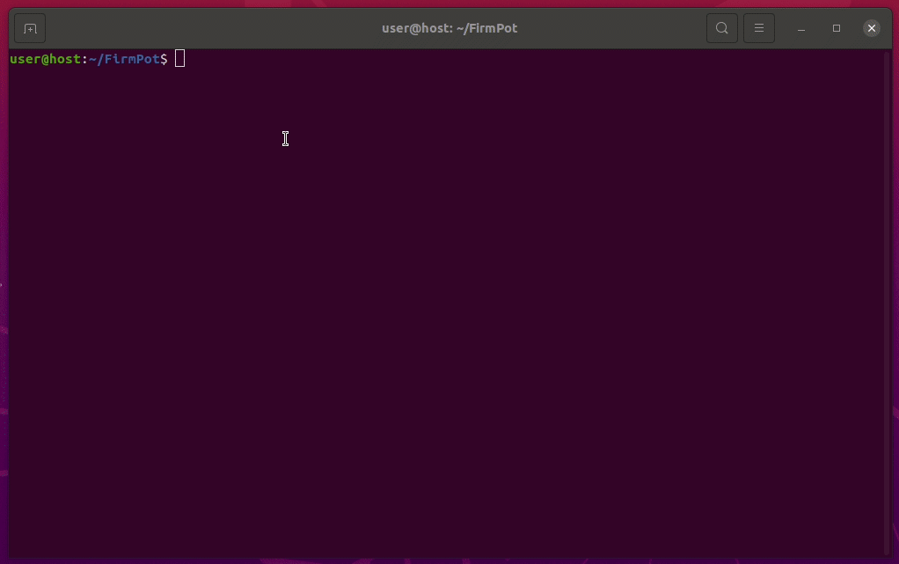
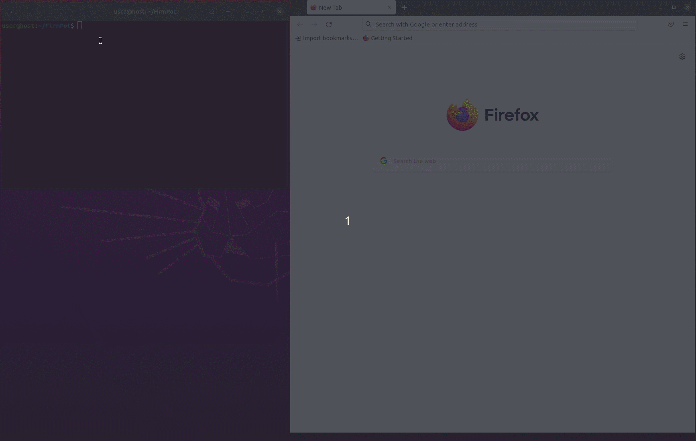
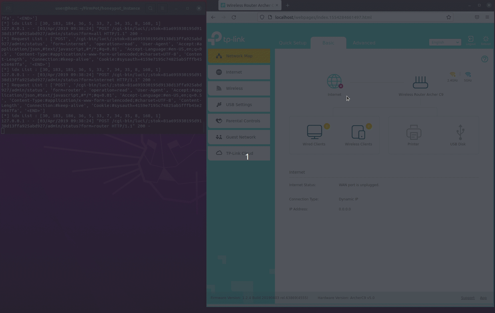
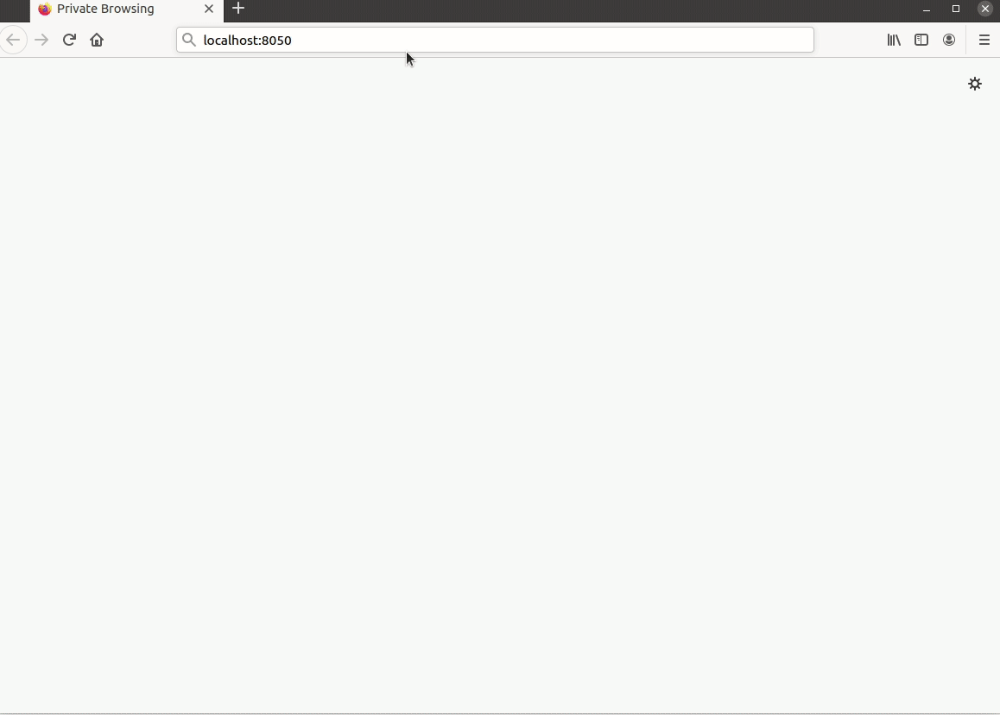
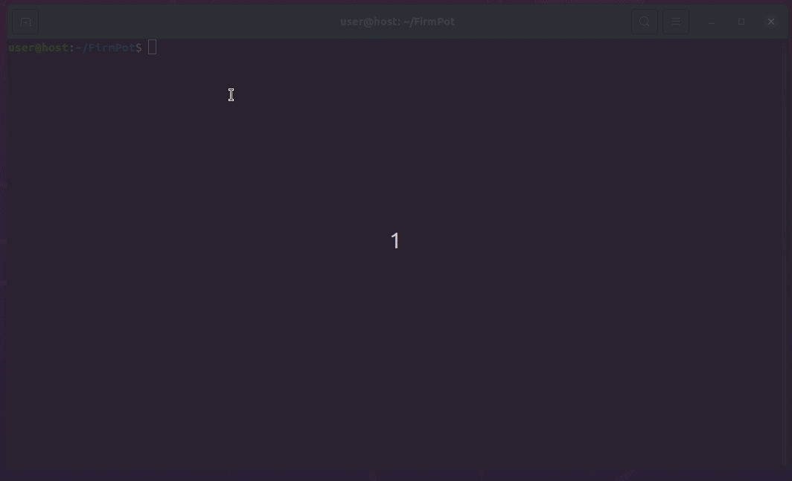

Demo1 (using TP-Link firmware)
===

## 1. Download a firmware image and decompress it
1. Move to `images/`
```
user@host:~/FirmPot$ cd images
```
2. Download a firmware image
This example uses the [Archer C9V5](https://www.tp-link.com/us/support/download/archer-c9/v5/#Firmware) from TP-Link
```
user@host:~/FirmPot/images$ wget "https://static.tp-link.com/2019/201904/20190415/Archer%20C9(US)_V5_190403.zip"
user@host:~/FirmPot/images$ ls
'Archer C9(US)_V5_190403.zip'
```
3. Decompress the downloaded images
```
user@host:~/FirmPot/images$ unzip -j Archer\ C9\(US\)_V5_190403.zip 
Archive:  Archer C9(US)_V5_190403.zip
  inflating: c9v5_eu-up-ver1-2-4-P1_20190403-rel63869.bin  
  inflating: GPL License Terms.pdf  
  inflating: How to upgrade TP-LINK Wireless AC Router(New VI).pdf  
user@host:~/FirmPot/images$ ls
'Archer C9(US)_V5_190403.zip'
 c9v5_eu-up-ver1-2-4-P1_20190403-rel63869.bin <= Use this!
 GPL License Terms.pdf
'How to upgrade TP-LINK Wireless AC Router(New VI).pdf'
```

## 2. Change the parameters if necessary
```
user@host:~/FirmPot$ vim utils/params.py 
```

## 3. Boot the web application from the firmware image
- Run `booter.py`
```
user@host:~/FirmPot$ python3 booter.py images/c9v5_eu-up-ver1-2-4-P1_20190403-rel63869.bin -c 1
[*] Try to extract filesystem from images/c9v5_eu-up-ver1-2-4-P1_20190403-rel63869.bin
[*] Success to extract : images/_c9v5_eu-up-ver1-2-4-P1_20190403-rel63869.bin.extracted/jffs2-root/fs_1/
[*] The extracted filesystem is OpenWrt-based.
[*] Arch : ['ARM,'] Bit : ['32-bit'] Endian : ['LSB']
[*] Copy QEMU user-mode binary to the filesystem
[*] One service found : S50uhttpd
[*] Generate new startup script.
[*] Run : sudo docker run -itd --privileged --net=network-0 --name=container-0 booter/image
[*] List of Accessible IP Address (HTTP)
http://172.20.0.2

[*] List of Accessible IP Address (HTTPS)
https://172.20.0.2
```

-  Confirm that the container is up by running `docker ps`
```
user@host:~/FirmPot$ sudo docker ps
CONTAINER ID   IMAGE          COMMAND          CREATED          STATUS          PORTS     NAMES
82d79469fd8e   booter/image   "./startup.sh"   40 seconds ago   Up 40 seconds             container-0
```

## 4. Scan the web application and collect the web interaction
- Run `scanner.py` to specify the container's IP address with `-i` option
    - IPaddress should start with http or https 
    - `--login-auto` is option for setting initial password 
```
user@host:~/FirmPot$ python3 scanner.py -i https://172.20.0.2 --login-auto
```


- `learning.db` is created in `./honeypot/`

## 5. Learn the web interactions stored in `learning.db`.
- Run `learner.py`
```
user@host:~/FirmPot$ python3 lerner.py
```



- You can output vectors and 2D plots of the words learned by word2vec with `./utils/word2vec.py`
```
user@host:~/FirmPot$ python3 utils/word2vec.py -w honeypot/word2vec.bin -r 5
```



## 6. Create the directory for the honeypot instance
- `manager.py` with `--create` option create the directory 
```
user@host:~/FirmPot$ python3 manager.py --create
user@host:~/FirmPot$ ls honeypot_instance/
checkpoints    honeypot.py    honeypot_setup.sh    response.db    utils    word2vec.bin    
```



## 7. Launch honeypot instance
- Move to `honeypot_instance` and run `honeypot.py`
```
user@host:~/FirmPot$ cd honeypot_instance
user@host:~/FirmPot/honeypot_instance$ sudo python3 honeypot.py 
```




## 8. Analyze the accesslog
- Run `analyzer.py`
```
user@host:~/FirmPot$ python3 analyzer.py honeypot_instance/logs/access.log
```



## 9. Delete containers
- Run `utils/delete_containers.py`
```
user@host:~/FirmPot$ python3 utils/delete_containers.py
```



