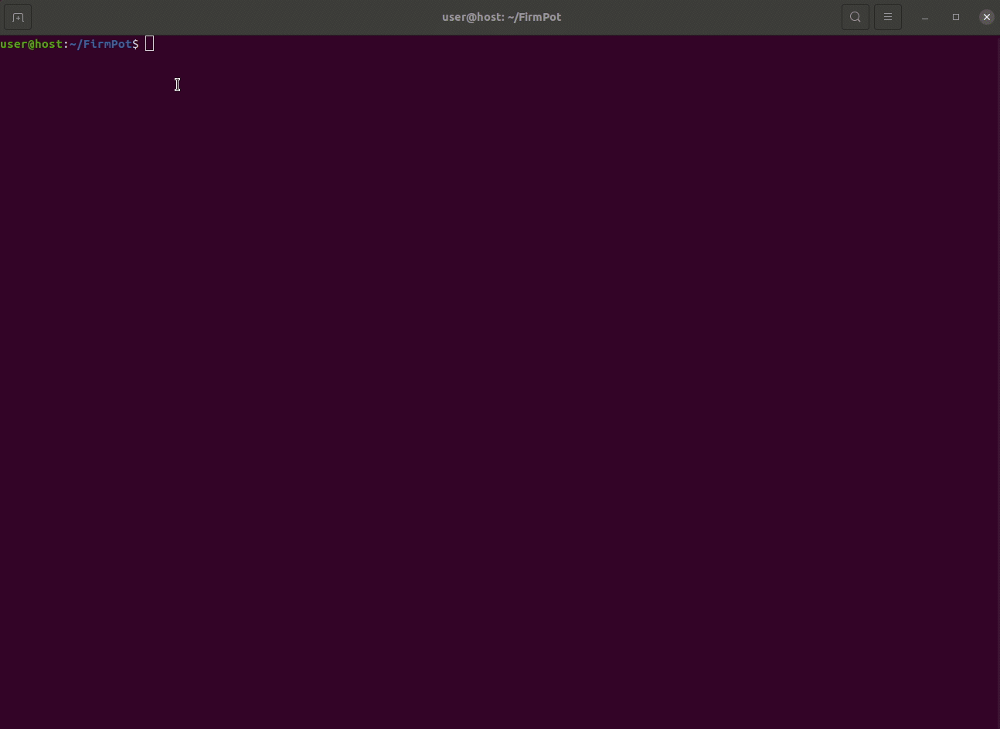
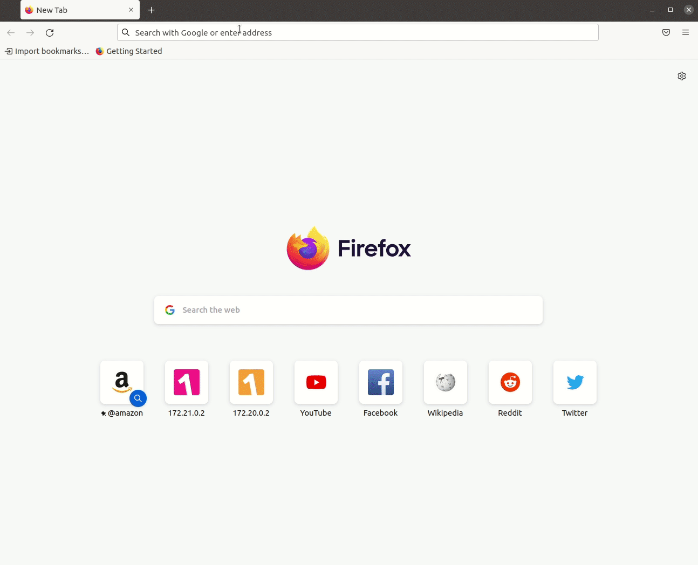
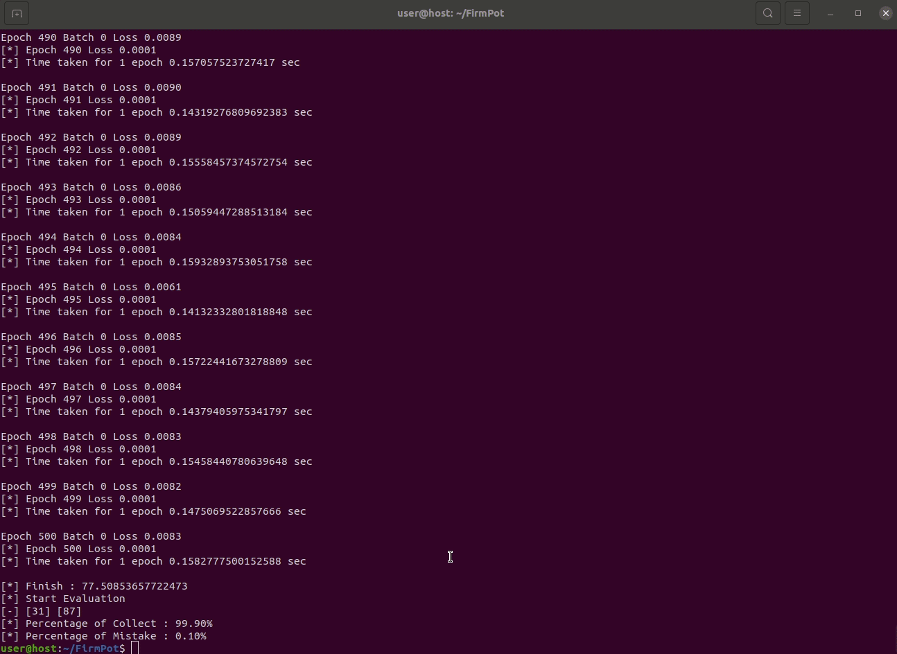
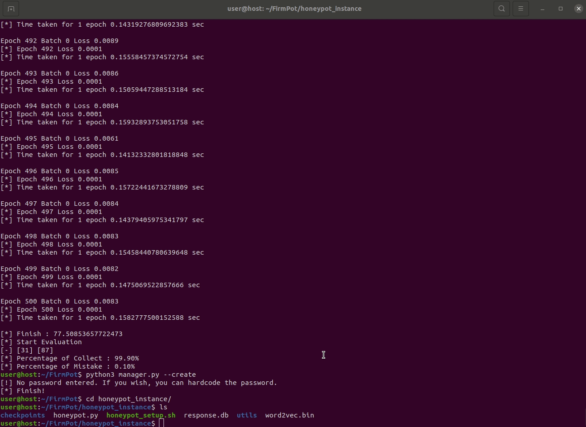
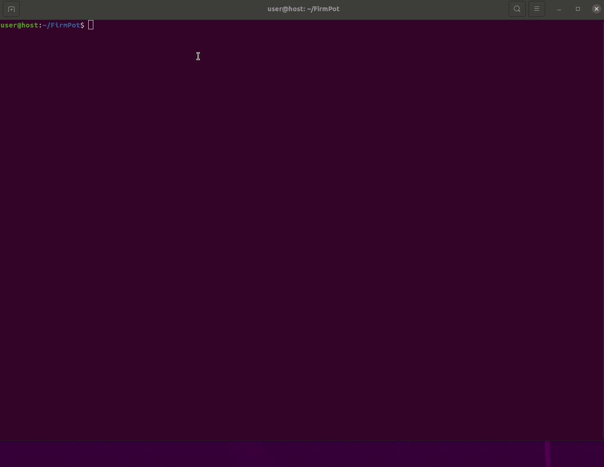

Demo2 (using OpenWrt firmware)
===

## 1. Download a firmware image and decompress it
1. Move to `images/`
```
user@host:~/FirmPot$ cd images
```
2. Download a firmware image
This example uses the [ppc40x image](https://archive.openwrt.org/backfire/10.03.1/ppc40x/) from OpenWrt
```
user@host:~/FirmPot/images$ wget https://archive.openwrt.org/backfire/10.03.1/ppc40x/openwrt-ppc40x-kilauea-squashfs.img
```

## 2. Change the parameters if necessary
```
user@host:~/FirmPot$ vim utils/params.py 
```

## 3. Boot the web application from the firmware image
- Run `booter.py`
```
user@host:~/FirmPot$ python3 booter.py images/openwrt-ppc40x-kilauea-squashfs.img -c 3
```


## 4. Scan the web application and collect the web interaction
1. Manually set initial passwords for all launched containers



2. Run `scanner.py` to specify the container's IP address with `-i` option
```
user@host:~/FirmPot$ python3 scanner.py -i http://172.20.0.2 http://172.21.0.2 http://172.22.0.2 
```


3. You can collect the interactions manually by setting the number of seconds in the `-m` option
```
user@host:~/FirmPot$ python3 scanner.py -i http://172.20.0.2 http://172.21.0.2 http://172.22.0.2 -m <seconds>
```


## 5. Learn the web interactions stored in `learning.db`.
- Run `learner.py`
```
user@host:~/FirmPot$ python3 lerner.py
```


## 6. Create the directory for the honeypot instance
- `manager.py` with `--create` option create the directory 
```
user@host:~/FirmPot$ python3 manager.py --create
user@host:~/FirmPot$ ls honeypot_instance/
checkpoints    honeypot.py    honeypot_setup.sh    response.db    utils    word2vec.bin    
```



## 7. Launch honeypot instance
- Move to `honeypot_instance` and run `honeypot.py`
```
user@host:~/FirmPot$ cd honeypot_instance
user@host:~/FirmPot/honeypot_instance$ sudo python3 honeypot.py 
```



## 8. Delete containers
- Run `utils/delete_containers.py`
```
user@host:~/FirmPot$ python3 utils/delete_containers.py
```

